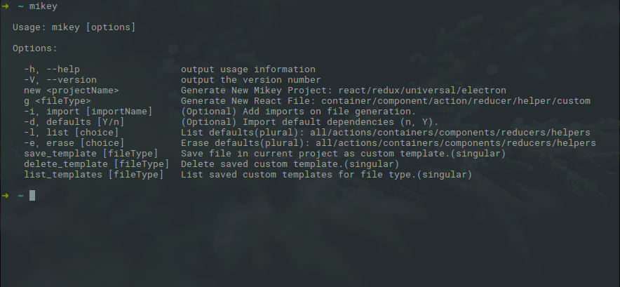

# mikey
### *Mikey* is a React-Redux framework for generating React-Redux projects and React-Redux files.

Inspired by Rails generate; *Mikey* is a CLI / Framework for React/Redux applications. *Mikey* was designed to be simple, intuitive to use, and increase development speed and productivity of React/Redux applications. *Mikey* can generate React/Redux projects and files, saving the developer valuable time that can be spent building features. *Mikey* can also be used in most React/Redux projects and is intended to be a broad solution.



<strong>Example Applications:</strong>

[Regular Mikey Example](https://github.com/otis-bot/otis-frontend)

[React Mikey Example (No Redux Coming Soon!)]()

[Universal Mikey Example](https://github.com/Mikeysax/mikeyUniversalExample)

[Electron Mikey Example](https://github.com/Mikeysax/Munote)
___
### Installation

<strong>To Install *Mikey*:</strong>

```$ npm install mikey -g```

To see a list of commands:

```$ mikey```
___
### Project Generation

<strong>To Generate a new project:</strong>

```$ mikey new projectType```

<strong>The different project types are:</strong>

```react``` : react / webpack 2 (no redux).

```redux``` : react-redux / webpack 2.

```universal``` : react-redux / webpack 2, with server rendering. This also has an API version which is setup to use Waterline and Postgresql out of the box.

```electron``` : react-redux / webpack, served via electron.


<strong>After the new command, *Mikey* will ask for the project name.</strong>

When you create a new project, *Mikey* will run ```yarn install``` automatically in the created project directory. All you have to do is be patient.
___
Once ```yarn install``` is done, ```cd``` to project and start the server with:

React and React-Redux Projects: ```$ npm start```

Universal and Electron projects: ```$ npm run dev```

___
*Mikey* projects are compatible with React / Redux Dev Chrome Extensions / Electron Dev Tools... and hot reloading is enabled. Dependencies are kept as minimal as possible. *Mikey* also contains Babel for ES6 compatibility, SCSS/CSS/Image loaders, Testing Setup with Enzyme and other testing dependencies, Production/Dev Config, and Source Mapping. Universal projects take advantage of Redux Async Connect / Redux-Connect fork to pre-load data onto the server before rendering. Almost every project template uses Webpack 2.

___
To build for production:

```$ npm run build```

For Electron project build and package for production:

```$ npm run build``` && ```$ npm run package``` || ```$ npm run package-all```

___
### File Generation

<strong>To generate a new react file:</strong>

```$ mikey g fileType```

Pick any filetype: container / component / action / helper / reducer

Mikey will ask you for a file name after you choose a filetype.

<strong>Custom Files(section blow):</strong>

```$ mikey g custom```

<strong>Use these commands in the root of your project.</strong>

___
#### <strong>*Mikey* classification and description of file type:</strong>

<strong>[Containers](http://redux.js.org/docs/basics/UsageWithReact.html)</strong> are components which connect to your store. Containers should act as further separation of logic and view.

<strong>[Components](http://redux.js.org/docs/basics/UsageWithReact.html)</strong> are primarily the view layer and rendered inside of Containers.

<strong>[Reducers](http://redux.js.org/docs/basics/Reducers.html)</strong> are responsible for updating the state of your application. Reducers are pure functions, meaning they do not mutate the state. Reducers take the current state and return a new state object.

<strong>[Actions](http://redux.js.org/docs/basics/Actions.html)</strong> are dispatched with a type and payload. Actions work with Reducers in updating the application store. Actions can contain Ajax requests or new information generated by a User.

<strong>Helpers</strong> are used for organizing random methods which can clutter your Containers and Components. Using helpers enable you to reuse methods over and over throughout your project (DRYer).

___
##### <strong>On File Creation Specifics:</strong>

On file creation, *Mikey* will look through your working project directory for actions/components/containers/reducers/helpers folders and create the corresponding file type. If none of these folders exist, *Mikey* will create the file in the root of your project.

*Mikey* will also generate a .scss file in the CSS folder when you generate a component or container.

<strong>*Mikey* also creates ```.mikeyPath``` folder</strong> in your project and saves the path of the file type generated. This is to optimize the speed of file creation. By saving this path *Mikey* does not have to dynamically find the folder again after each generated file.

<strong>A Test file is also generated when you generate a file.</strong>

If your project directory changes at all, delete ```.mikeyPath``` folder to recache folder paths. ```.mikeyPath``` folder is added to ```.gitignore``` also.

<strong>You cannot create files that already exist. *Mikey* will prevent you from overwriting files you have already generated.</strong>
___
### mikey.json Details

On file generation, *Mikey* will check the root of your project to see if a ```mikey.json``` file exists. If ```mikey.json``` does not exist it will be generated.

Inside ```mikey.json``` contains settings for css generation, css folder name, css extension, and testing generation.

- css: Can be set to a boolean and determines if *Mikey* should generate a css file.

- cssFolder: Can be set to the name of the folder that contains your CSS files.

- cssExtension: This determines what extension the CSS files *Mikey* generates will have.

- testing: Can be set to a boolean and determines if *Mikey* should generate a test.

___
### Adding Imports on File Generation

<strong>To generate a new file and import one or multiple dependencies to top of file:</strong>

```$ mikey g fileType -i depName```  

<strong>To import multiple dependencies to top of file:</strong>

```$ mikey g fileType -i depName -i depName -i depName```

<strong>To import with curly brackets:</strong>

```$ mikey g fileType -i {connect},react-redux```

You can import with a comma and it will split it correctly:

```import {connect} from 'react-redux';```

If the imports are not currently listed in your projects ```package.json``` file dependencies, they will be automatically installed by ```npm```.

___
### Defaults

<strong>*Mikey* will remember</strong> previous imports and store them as defaults for each file type. Stored imports are only stored once per file type.

You can include defaults by typing ```-d Y``` (for Yes) for using defaults, at the end of the generation command:

```$ mikey g fileType -d Y```

If the defaults are not currently listed in your projects ```package.json``` file dependencies, they will be automatically installed by ```npm```.
___
#### <strong>To list defaults:</strong>

```$ mikey list fileType```    |    ```$ mikey -l fileType```

If you want to list all stored defaults:

```$ mikey list all```    |    ```$ mikey -l all```
___
#### <strong>To erase defaults:</strong>

```$ mikey erase fileType```    |    ```$ mikey -e fileType```

If you want to erase all stored defaults:

```$ mikey erase all```    |    ```$ mikey -e all```

___
### Custom Templates

#### Saving Custom Templates:
<strong>*Mikey*</strong> will allow you to save your projects react file as a template. The file you wish to save should be in your current project. Create a file in containers / components / reducers / actions / helpers folders and use the:

```$ mikey save_template fileType```

This command will save the file inside of *Mikey* as a custom template. File selection is <strong>without the .js extension</strong>. A list of files you can save will be displayed.

___
#### Generating Custom Files from Custom Templates:

Once you've saved a template, you can reuse it in any project.

```$ mikey g fileType```

A list of custom templates of that file type will be displayed. A prompt will be displayed in the console for template choice and desired file name. The template file name will be used by default if no new name is entered. File selection is <strong>without the .js extension</strong>

___
#### Deleting Custom Files from Custom Templates:

If you want to delete a custom template:

```$ mikey delete_template fileType```

A list of custom templates of that file type will be displayed. The prompt will then ask which file you would like to delete. File selection is <strong>without the .js extension</strong>

___
#### List Custom Files from Custom Templates:

If you would like to look at saved custom templates:

```$ mikey list_templates fileType```

This will display all saved custom templates for current file type.

___
### Contribute
<strong>If you would like to contribute, it would be greatly appreciated.</strong>

___
#### <strong>For help and more commands:</strong>

```$ mikey -h``` | ```$ mikey -V``` | ```$ mikey```

___

#### <strong>Version History:</strong>

<strong>3.9.0</strong>: *Mikey* now uses ```yarn``` to install project dependencies, greatly decreasing the time it takes to generate a full project.

<strong>3.8.0</strong>: *Mikey* Universal projects are now updated to <strong>Webpack 2</strong>. Universal projects also have an API version which are setup to use Waterline and Postgresql out of the box. There are also examples of user authentication using JSON web tokens which can serve as a guide or be used.

<strong>3.7.1</strong>: *Mikey* now automatically adds an import statement to App.js for generated CSS files. *Mikey* also has many more edge cases covered when generating a project or file to prevent accidental creation of files with no names and project with incorrect project types. Also, null or undefined paths will not be saved to .mikeyPath anymore.

<strong>3.6.1</strong>: *Mikey* now creates a ```mikey.json``` file in the root of your project to determine css style settings/generation and testing generation.

<strong>3.5.0</strong>: Generated mikey projects auto import all CSS files. On file generation for components and containers a .scss file will be created with the same name in snake_case.

<strong>3.4.6</strong>: Complete refactor of file generation into one command.

<strong>3.3.1</strong>: Complete refactor of project generation into one command.

<strong>3.2.0</strong>: ```mikey``` installs dependencies from importing via file generation and using defaults.

<strong>3.1.0</strong>: Added React (Without Redux) project generation with `mikey react projectName`. This project is the only project which does not contain Redux.

<strong>3.0.5</strong>: Added Electron project generation with `mikey electron projectName`. For more information consult the readme file in a generated Electron project.

<strong>2.1.6</strong>: Added Universal / Isomorphic project generation with `mikey universal projectName`. The Universal template uses redux-connect package, a fork of Redux Async Connect package, to pre-load
data from AJAX calls onto the server. For examples you can take a look at the example from of how to use this feature.

<strong>1.7.3</strong>: Added more test templates. Test template is chosen based on which file you are generating. Fixed README and added LICENSE text. Removed some console.log statements which were redundant. Changed helper template to contain basic const.

<strong>1.6.3</strong>: Added Custom Template generation/saving/deletion/listing. Refactored file generation to be DRY'er. When you deal with custom templates, prompts will be given to obtain more details about files. List is displayed on template deletion command. Ability to save a file in current project to reuse.

<strong>1.5.0</strong>: Changed Project generation to `spawn` instead of `exec`. Added some fun tidbits like colors and art to project generation. Refactored project generation to be cleaner and output more helpful information. Updated project template dependencies.

<strong>1.4.4</strong>: Mikey displays help when just typing ```mikey```. Modified Project Template App.js and store.js file to be more logical. Added actions index to import all actions to.

<strong>1.3.6</strong>: Generating files also generate corresponding tests. Switched testing files to .test.js to keep with consistency of other aspects of mikey. Previous generated projects will need to switch test script in package.json to be compatible with newly generated tests. Added new container template.

<strong>1.2.4</strong>: Project Template uses enzyme for testing.

<strong>1.1.8</strong>: New CLI Commands which are direct and logical, testing integrated in Project Creation Template. README reflects all changes for New CLI Commands and movement towards *Mikey* as a Framework.

<strong>1.0.0</strong>: New Project Creation Template with More Concise Documentation.
